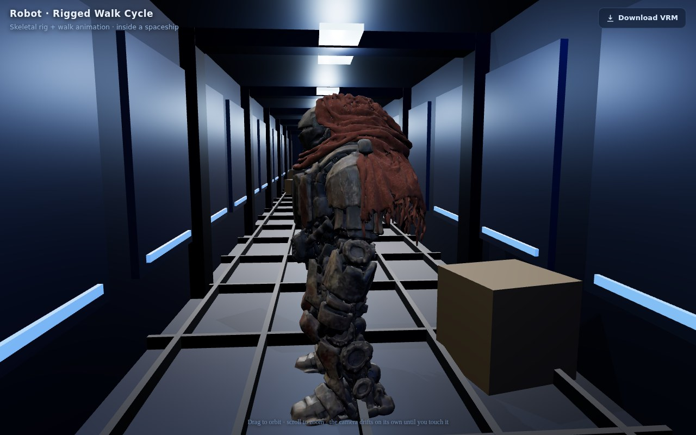

# Robot — rigged walk demo

A static 3D scan of a robot, rigged into an animated humanoid and set walking
through a spaceship corridor in the browser with [three.js](https://threejs.org).



## What's here

| File | What it is |
| --- | --- |
| `robot.vrm` | The rigged robot. A **[VRM 0.x](https://vrm.dev) humanoid avatar** — a skeleton skinned to the mesh, a baked `Walk` animation clip, and the standard VRM humanoid bone map. Download it and load it in any VRM app (VSeeFace, VRoid Hub, the Blender VRM add-on, three-vrm…) or any glTF 2.0 viewer. |
| `index.html` | The spaceship walk demo — loads `robot.vrm`, plays the walk clip, and paces the robot up and down a procedurally-built corridor. |
| `vendor/` | three.js r160 (core + `GLTFLoader`, `OrbitControls`, `RoomEnvironment`), vendored so the demo runs with no external CDN. |

## View it

The demo uses ES modules and `fetch`, so it must be served over HTTP (opening
`index.html` from disk won't work).

```
npm start           # from the repo root — prints a Network: URL
```

Then open **`/demo/`** at that address. Once the repo is published to GitHub
Pages it's also live at `https://ericterzo.github.io/GameOfDNA/demo/`.

Drag to orbit, scroll to zoom. Until you touch it, a chase-cam follows the
robot on its own.

## How the rig was built

The source model was a single, un-rigged, textured scan mesh (~290k triangles,
no skeleton). Rigging it:

1. **Skeleton.** The silhouette was analysed to locate the hips, spine, chest,
   neck/head, shoulders/arms and legs/feet, and a 21-bone skeleton was placed
   to match. The bones are named to the **standard VRM humanoid** set, so the
   result is a true humanoid avatar, not just an animated mesh.
2. **Skinning.** Every vertex was weighted to the nearest bone segments
   (distance-to-capsule falloff, up to 4 influences, with a left/right penalty
   so limbs don't bleed across the centre line) — semi-rigid weighting that
   suits an armoured robot.
3. **Walk cycle.** A one-second looping clip was hand-authored: opposite-phase
   hip swing with a knee tuck on the swing leg, counter-swinging arms, a
   double-bounce vertical bob and a little hip roll. It's baked into the VRM as
   a glTF animation named `Walk`.
4. **Export.** Written out as a `.vrm` (glTF 2.0 + the `VRM` extension) with the
   textures transcoded from WebP to JPEG for broad viewer compatibility.

The demo itself builds the corridor (hull, ribs, light strips, grated floor,
viewports to a starfield, crates), lights it with an image-based environment so
the metal reads correctly, and drives the robot's position while the baked clip
animates the legs.
